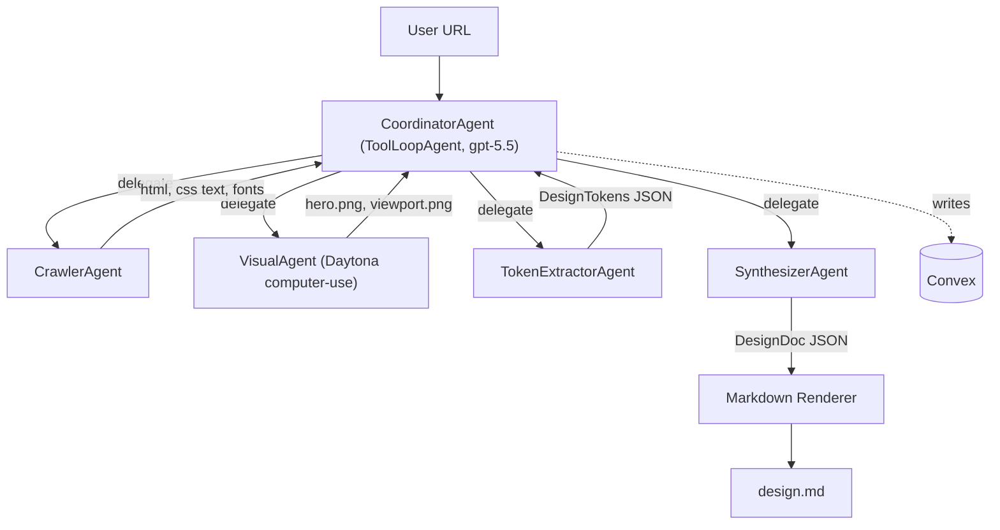
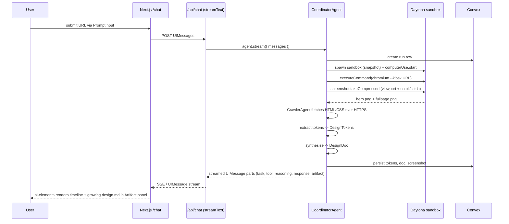

# getdesign — Architecture

On-demand design systems from any URL. A user pastes a URL, an agent explores the live site with a real browser inside a [Daytona](https://www.daytona.io/docs/en/computer-use/) sandbox, extracts tokens and screenshots, and returns a `design.md` matching the reference Cursor-style 9-section template.

This document mixes two things on purpose:

- the long-term target architecture for the product
- notes about the current repository state

When the two differ, the code in this repository is the source of truth for what is implemented today.

## 1. Product surface

Current implementation status:

- `apps/web` is implemented as a marketing site plus `/design` showcase.
- `apps/web/app/api/waitlist/route.ts` is the only shipped API route in this repo today.
- `packages/cli` and `packages/sdk` are placeholder packages, not full end-user surfaces yet.
- `skills/getdesign` is the implemented portable skill surface.

Four consumer surfaces, one agent core.

- **Landing + chat UI** — [apps/web](apps/web) (Next.js 16, App Router, deployed on Vercel). Streaming chat built with [ai-elements](https://www.npmjs.com/package/ai-elements): `Conversation`, `Message`, `PromptInput`, `Task`, `Tool`, `Reasoning`, `Response`, `Sources`, `Image`, and an `Artifact` side panel that renders the growing `design.md`.
- **HTTP API** — [apps/api](apps/api) (Bun + [Hono](https://hono.dev) on Vercel Functions, Node runtime). Single endpoint: `GET /?url=https://cursor.com` returns `text/markdown; charset=utf-8` (the final `design.md`). Read-only, no auth in v1.
- **CLI** — [apps/cli](apps/cli) (Bun single-file binary). Two modes: `getdesign <url>` one-shot and `getdesign chat` interactive REPL ([OpenTUI](https://github.com/openturn/opentui)) that hits the same agent transport.
- **TypeScript SDK** — [packages/sdk](packages/sdk) (`getdesign` on npm). A typed client library for Node, Bun, Deno, and edge runtimes. Two entry points: `getDesign(url)` returns a Promise of the final `design.md` + structured `DesignDoc`; `streamDesign(url)` returns an async iterator of progress events for custom UIs. Used by the CLI internally, by AI coding tools programmatically, and by third-party integrations.

All four surfaces call the same agent package; only the transport differs.

## 2. Repository layout (Turborepo, Bun)

Current repository snapshot:

```text
getdesign/
├── apps/
│   └── web/          Next.js 16 — landing, /design, waitlist route
├── packages/
│   ├── cli/          Placeholder npm CLI package
│   ├── config/       Shared tsconfig package
│   ├── sdk/          Placeholder npm SDK package
│   ├── tools/        Placeholder tools package
│   └── types/        Placeholder shared types package
├── convex/           Convex functions (runs, messages, tokens, screenshots, artifacts)
├── skills/           Portable agent skill(s)
├── turbo.json
├── bun.lock
└── package.json      workspaces: apps/*, packages/*
```

Target repository layout (planned, not fully scaffolded yet):

```text
getdesign/
├── apps/
│   ├── web/
│   ├── api/
│   ├── cli/
│   └── docs/
├── packages/
│   ├── agent/
│   ├── tools/
│   ├── sdk/
│   ├── ui/
│   ├── types/
│   └── config/
├── convex/
├── infra/daytona/
├── turbo.json
├── bun.lock
└── package.json
```

Rationale for the maximal split: the eventual `packages/agent` is reused by web, api, and cli with zero framework coupling; `packages/tools` is what Convex and the AI SDK both call.

## 3. Tech stack and citations

- **Runtime**: [Bun](https://bun.sh) for CLI + API; Node on Vercel Functions for web.
- **Build**: [Turborepo](https://turborepo.com/docs) with remote caching on Vercel.
- **AI SDK**: [`ai` v6](https://ai-sdk.dev) via the [Vercel AI Gateway](https://vercel.com/docs/ai-gateway). Model: OpenAI GPT-5.5 class; resolve the exact gateway id live per the ai-sdk skill:
  ```bash
  curl -s https://ai-gateway.vercel.sh/v1/models \
    | jq -r '[.data[] | select(.id | startswith("openai/")) | .id] | reverse | .[]'
  ```
- **Agents**: `ToolLoopAgent` + `InferAgentUIMessage` per AI SDK v6 docs (`node_modules/ai/docs/` after `bun add ai`).
- **Chat UI primitives**: [ai-elements](https://ai-sdk.dev/elements) on top of [shadcn/ui](https://ui.shadcn.com).
- **Browser + screenshots**: Chromium launched inside the Daytona Xvfb desktop via `sandbox.process.executeCommand(...)`, captured with Daytona's own [`computerUse.screenshot.takeCompressed()`](https://www.daytona.io/docs/en/computer-use/#take-compressed) / `takeRegion()`. No Playwright, no CDP — we treat the sandbox like a real desktop and screenshot the X screen. Display size is set via the snapshot's Xvfb config so the "viewport" is deterministic (e.g. 1440×900, with a taller virtual screen for full-page captures via scroll-and-stitch).
- **Computer-use integration**: [Daytona Computer Use](https://www.daytona.io/docs/en/computer-use/) — `sandbox.computerUse.start()` brings up Xvfb + xfce4 + x11vnc; we then use [`mouse.scroll`](https://www.daytona.io/docs/en/computer-use/#scroll), [`keyboard.hotkey`](https://www.daytona.io/docs/en/computer-use/#hotkey), and [`screenshot.takeCompressed`](https://www.daytona.io/docs/en/computer-use/#take-compressed) as the only browser primitives.
- **Persistence**: [Convex](https://docs.convex.dev) — real-time DB, functions, and file storage for runs, UIMessage history, extracted tokens, and screenshots.
- **Hosting**: Vercel for web + api (separate Vercel projects); CLI distributed via npm + GitHub releases.

## 4. Agent topology (sub-agents)



Each sub-agent is itself a `ToolLoopAgent` exposed to the coordinator as a single `delegate` tool (per AI SDK v6 sub-agent pattern). Typed end-to-end with `InferAgentUIMessage<typeof coordinator>`.

- **CoordinatorAgent** — plans, calls sub-agents, ensures every run does: (1) crawl, (2) `always_hero` screenshot via VisualAgent, (3) extract tokens, (4) synthesize.
- **CrawlerAgent** — static network tools (no browser needed): `fetchHtml`, `fetchStylesheets`, `resolveFonts`, `parseComputedStylesFromInlined` (resolves `<link rel="stylesheet">`, `@import`, `@font-face`). Runs in Bun on the API server, not in Daytona, to keep sandbox life short.
- **VisualAgent** — tools that wrap the [Daytona TypeScript SDK](https://www.daytona.io/docs/en/computer-use/) directly:
  - `daytonaSpawn` — `daytona.create({ snapshot: 'getdesign-<sha>' })` + `sandbox.computerUse.start()`.
  - `daytonaOpenUrl(url)` — `sandbox.process.executeCommand("DISPLAY=:1 chromium --kiosk --no-first-run --hide-crash-restore-bubble --disable-session-crashed-bubble <url>")` and polls until the page is idle.
  - `daytonaScreenshotViewport()` — wraps `sandbox.computerUse.screenshot.takeCompressed({ format: 'png', showCursor: false })`.
  - `daytonaScreenshotFullPage()` — scroll-and-stitch: repeatedly `mouse.scroll(..., 'down', N)` + `takeCompressed`, then stitch server-side with [`sharp`](https://sharp.pixelplumbing.com) into one tall PNG.
  - `daytonaStop` — `sandbox.delete()`.

  `always_hero` policy: at least one viewport + one full-page screenshot per run, uploaded to Convex file storage, surfaced to the synthesizer as image message parts.
- **TokenExtractorAgent** — pure deterministic tools (no LLM calls unless ambiguous): `extractColors` (walk computed styles, cluster by frequency/role), `extractTypography`, `extractSpacing`, `extractRadii`, `extractShadows`, `extractBorders`. Emits a `DesignTokens` [Zod v4](https://zod.dev) object.
- **SynthesizerAgent** — takes `DesignTokens` + `hero.png` + crawl notes, returns a `DesignDoc` conforming to a Zod schema with exactly the 9 sections from the reference example. Then a deterministic renderer in [packages/ui/src/renderDesignMd.ts](packages/ui/src/renderDesignMd.ts) converts `DesignDoc` → markdown. This guarantees the exact template ("exact_template" choice).

## 5. 9-section schema (exact template)

Defined in [packages/types/src/design-doc.ts](packages/types/src/design-doc.ts) as a Zod schema. Keys map 1:1 to the sections in the reference example:

1. `visualTheme` — narrative prose + `keyCharacteristics[]`
2. `palette` — `primary`, `accent`, `semantic`, `featureColors`, `surfaceScale`, `borderColors`, `shadows`
3. `typography` — `fontFamily`, `hierarchy[]` (role, font, size, weight, lineHeight, letterSpacing, notes), `principles[]`
4. `components` — `buttons[]`, `cards`, `inputs`, `navigation`, `imageTreatment`, `distinctive[]`
5. `layout` — `spacing`, `grid`, `whitespace`, `radiusScale`
6. `depth` — `levels[]`, `philosophy`
7. `interaction` — `hoverStates`, `focusStates`, `transitions`
8. `responsive` — `breakpoints[]`, `touchTargets`, `collapsingStrategy`, `imageBehavior`
9. `agentPromptGuide` — `quickColorRef`, `examplePrompts[]`, `iterationGuide[]`

The renderer is deterministic; the LLM cannot drift from the template.

## 6. Daytona lifecycle (reuse_snapshot)

Custom snapshot, spawn per request.

- **Build once**: `daytonaio/snapshot:getdesign-<sha>` baked from [infra/daytona/Dockerfile](infra/daytona/Dockerfile) that pre-installs Chromium, `xdotool`, `wmctrl`, `sharp` deps, common web fonts (Inter, Noto Sans / Serif / Color-Emoji, Liberation, DejaVu), and a tuned Xvfb resolution (1440×900×24). Published via `daytona snapshot push`.
- **Per request**: `daytona.create({ snapshot: 'getdesign-<sha>' })` → `sandbox.computerUse.start()` → `daytonaOpenUrl(url)` launches Chromium kiosk on `DISPLAY=:1` → wait for page-ready heuristic → `sandbox.computerUse.screenshot.takeCompressed({ format: 'png' })` for viewport, then scroll-and-stitch full-page → upload to Convex → `sandbox.delete()`. Target cold-start: under 5 s because the snapshot is pre-baked.
- **Interactive escape hatch** (wired, off by default): if the synthesizer needs a hover/click state, VisualAgent uses [`sandbox.computerUse.mouse.move/click`](https://www.daytona.io/docs/en/computer-use/#click) + another `takeCompressed()`. This is the same API path as the hero capture, so there is no second rendering system.

## 7. Request flows

### Chat flow

[apps/web/app/api/chat/route.ts](apps/web/app/api/chat/route.ts):



### API flow

[apps/api/src/index.ts](apps/api/src/index.ts): same coordinator, awaits full result, returns `renderDesignMd(doc)` as `text/markdown`. No streaming, no UIMessage parts.

### CLI flow

[apps/cli/src/index.ts](apps/cli/src/index.ts): one-shot imports [packages/agent](packages/agent) directly (no network hop) when `DAYTONA_API_KEY` + `OPENAI_API_KEY` / gateway are set locally; otherwise falls back to calling the hosted API. `getdesign chat` opens an OpenTUI REPL that renders the same UIMessage stream.

## 8. Convex schema (key tables)

Defined in [convex/schema.ts](convex/schema.ts):

- `runs` — `{ url, status, startedAt, finishedAt, model, sandboxId, heroStorageId, docStorageId }`
- `messages` — UIMessage parts indexed by `runId` (for chat replay)
- `tokens` — `DesignTokens` JSON per run
- `artifacts` — rendered markdown per run, plus any intermediate partials
- `screenshots` — file storage ids + metadata (width, height, viewport)

Convex `action` functions wrap the agent so long-running runs survive browser reload; the web client subscribes via `useQuery`.

## 9. Streaming contract (AI SDK v6)

- **Server**: `streamText({ model: gateway('openai/gpt-5.5'), messages, tools, experimental_telemetry })` returned via `toUIMessageStreamResponse()`.
- **UIMessage parts** surfaced to the client, each mapped to an ai-elements component:
  - `tool-crawl.*` → `Task` + `Tool`
  - `tool-screenshot.*` → `Tool` + `Image` (shows hero as it arrives)
  - `tool-extractTokens.*` → `Task`
  - `reasoning` → `Reasoning`
  - `text` → `Response` streamed into `Artifact` panel as markdown
  - `source-url` (from crawl) → `Sources`
- **Types** shared via `export type GetDesignUIMessage = InferAgentUIMessage<typeof coordinator>` in [packages/agent/src/types.ts](packages/agent/src/types.ts), consumed by `useChat<GetDesignUIMessage>()` in the web app.

## 9a. TypeScript SDK

Published as [`getdesign`](https://www.npmjs.com/package/getdesign) on npm. Implemented in [packages/sdk](packages/sdk) as a thin client over the HTTP API (so it works in every JS runtime without dragging Daytona / OpenAI deps into the caller's bundle). Also re-exports the `DesignDoc` and `DesignTokens` Zod types from [@getdesign/types](packages/types).

```ts
import { getDesign, streamDesign } from "getdesign";
import type { DesignDoc } from "getdesign";

// One-shot
const { markdown, doc } = await getDesign("https://cursor.com");
// markdown: string   -> final design.md
// doc:      DesignDoc -> structured 9-section object (Zod-validated)

// Streaming
for await (const event of streamDesign("https://cursor.com")) {
  switch (event.type) {
    case "phase":     // "crawl" | "screenshot" | "extract" | "synthesize"
    case "screenshot":// { viewport: "hero" | "fullpage"; imageUrl }
    case "tokens":    // DesignTokens
    case "delta":     // partial markdown chunk
    case "done":      // { markdown, doc }
    case "error":
  }
}
```

- **Runtime targets**: Node ≥ 20, Bun ≥ 1.2, Deno, Cloudflare Workers, Vercel Edge. Pure Web Fetch + Web Streams under the hood.
- **Transport**: `getDesign` calls `GET api.getdesign.app/?url=...` (§9, API flow). `streamDesign` calls a second SSE endpoint `GET api.getdesign.app/stream?url=...` that re-emits the server's UIMessage stream as typed events. Both endpoints are dogfooded by the CLI.
- **Config**: `getDesign(url, { baseUrl?, fetch?, signal?, apiKey? })`. `apiKey` is unused in v1 (matches PRD non-goals) but reserved.
- **Bundle**: ESM-only, zero runtime deps beyond `zod` (peer: `zod@^4`). Tree-shakeable; `streamDesign` imports split from `getDesign`.
- **Types**: full `DesignDoc`, `DesignTokens`, and every event shape are exported from the package root.

## 10. Non-goals for v1

- No follow-up chat (read-only generation).
- No auth, no rate limiting (add [Upstash](https://upstash.com/docs/redis/sdks/ratelimit-ts/gettingstarted) or Convex-based limit in v1.1).
- No compare-brands / diff mode.
- No database of historical runs exposed in UI (Convex stores them but no browse UI yet).
- No interactive computer-use states; hero screenshot only.

## 11. Open risks / verifications before implementation

- Confirm exact OpenAI model id available through Vercel AI Gateway (the ai-sdk skill mandates live check; `gpt-5.5` id TBD).
- Confirm Chromium kiosk launches cleanly on the Daytona Xvfb display without first-run prompts and that `--no-sandbox` is acceptable inside the sandbox. Validate full-page scroll-and-stitch produces pixel-accurate output on pages with sticky headers (we may need to hide `position: fixed` elements on subsequent tiles via a tiny injected stylesheet, or switch to `chromium --headless=new --screenshot` as a cleaner fallback for full-page and keep Daytona screenshots only for viewport + interactive states).
- Confirm AI SDK v6 `ToolLoopAgent` + `InferAgentUIMessage` API shapes against `node_modules/ai/docs/` after `bun add ai` (per ai-sdk skill: do not trust memory).
- Confirm Next.js 16 + ai-elements + [Convex](https://docs.convex.dev) coexist without React version mismatch (ai-elements requires shadcn/ui set up first).

## 12. Delivery order

1. Scaffold Turborepo with Bun workspaces (done).
2. Define Zod schemas in `@getdesign/types` (`DesignTokens`, `DesignDoc`).
3. Implement `@getdesign/tools`: `crawler`, `extractors`, `daytona`, `render`.
4. Author `infra/daytona/Dockerfile` and publish the custom snapshot.
5. Build `@getdesign/agent`: Crawler / Visual / TokenExtractor / Synthesizer / Coordinator.
6. Wire Convex (schema + actions + file storage).
7. Build `apps/web` (Next.js 16 + ai-elements + Artifact panel).
8. Build `apps/api` (Bun + Hono).
9. Build `packages/sdk` (`getdesign` on npm) — thin HTTP client with typed events.
10. Build `apps/cli` (Bun + OpenTUI) on top of the SDK.
11. E2E smoke test against `cursor.com`, `vercel.com`, `linear.app`; iterate the synthesizer prompt until output matches the reference template.
12. Deploy web + api to Vercel, publish SDK + CLI to npm.

## References

- Daytona Computer Use: <https://www.daytona.io/docs/en/computer-use/>
- Daytona TypeScript SDK: <https://www.daytona.io/docs/en/typescript-sdk/>
- AI SDK v6: <https://ai-sdk.dev>
- Vercel AI Gateway: <https://vercel.com/docs/ai-gateway>
- ai-elements: <https://ai-sdk.dev/elements> / <https://www.npmjs.com/package/ai-elements>
- shadcn/ui: <https://ui.shadcn.com>
- Next.js 16: <https://nextjs.org/docs>
- Turborepo: <https://turborepo.com/docs>
- Bun: <https://bun.sh/docs>
- Convex: <https://docs.convex.dev>
- Hono: <https://hono.dev>
- Zod v4: <https://zod.dev>
- OpenTUI: <https://github.com/openturn/opentui>
- Reference design-system output format: see `examples/design.md` (derived from the Cursor-inspired sample).
