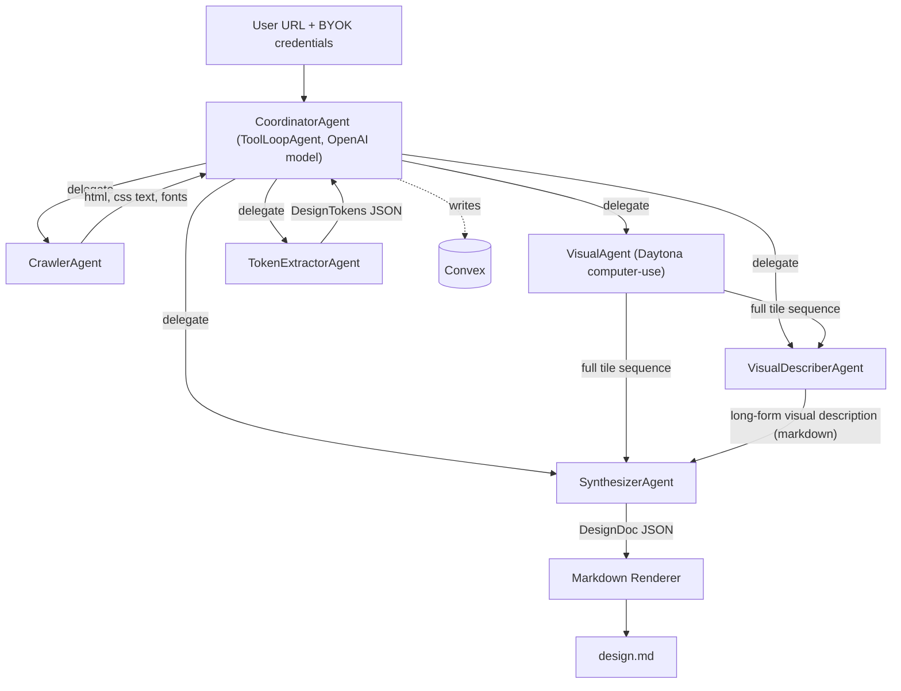
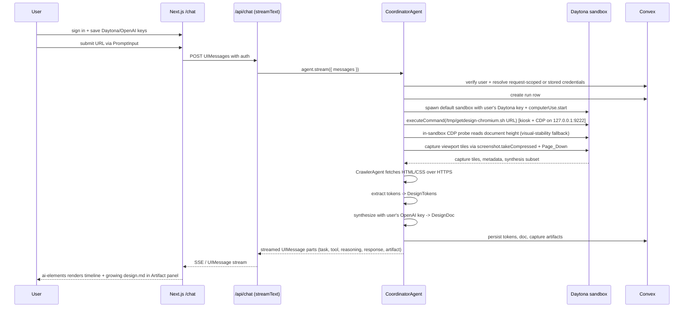

# getdesign — Architecture

On-demand design systems from any URL. An authenticated user provides their own Daytona and OpenAI credentials, either stored for web reuse or sent with an API/SDK/CLI request, submits a URL, and an agent explores the live site with a real browser inside a [Daytona](https://www.daytona.io/docs/en/computer-use/) sandbox, extracts tokens and capture artifacts, and returns a `design.md` matching the reference Cursor-style 9-section template.

This document mixes two things on purpose:

- the long-term target architecture for the product
- notes about the current repository state

When the two differ, the code in this repository is the source of truth for what is implemented today.

## 1. Product surface

Current implementation status:

- `apps/web` is implemented as a marketing site plus `/design` showcase.
- `apps/web/app/api/waitlist/route.ts` is the only shipped API route in this repo today.
- `apps/studio` is a separate Electron desktop Studio project, not one of the hosted getdesign URL-to-`design.md` surfaces.
- `apps/studio-site` is a separate Studio marketing/web project, not the main `getdesign.app` product surface.
- `packages/sdk` is now the Bun-first local execution SDK over the agent pipeline.
- `packages/cli` is now a Bun CLI adapter over `@getdesign/sdk`; it runs on the user's machine/server with request-scoped BYOK credentials.
- `skills/getdesign` is the implemented portable skill surface.

Four consumer surfaces, one agent core.

- **Landing + chat UI** — [apps/web](apps/web) (Next.js 16, App Router, deployed on Vercel). Streaming chat built with [ai-elements](https://www.npmjs.com/package/ai-elements): `Conversation`, `Message`, `PromptInput`, `Task`, `Tool`, `Reasoning`, `Response`, `Sources`, `Image`, and an `Artifact` side panel that renders the growing `design.md`.
- **HTTP API** — [apps/api](apps/api) (Bun + [Hono](https://hono.dev) on Vercel Functions, Node runtime). Single endpoint: authenticated `GET /?url=https://cursor.com` returns `text/markdown; charset=utf-8` (the final `design.md`) when the request provides Daytona and OpenAI credentials or the user has stored credentials.
- **CLI** — [packages/cli](packages/cli) (`@getdesign/cli` on npm). Bun binary adapter over `@getdesign/sdk`. One-shot mode is implemented; an interactive REPL remains a future surface.
- **TypeScript SDK** — [packages/sdk](packages/sdk) (`@getdesign/sdk` on npm). A Bun-first local execution SDK for machines/servers with enough runtime for browser capture and LLM generation. Two entry points: `getDesign(url)` runs the agent in-process and returns the final `design.md` + structured `DesignDoc`; `streamDesign(url)` runs the same pipeline and returns an async iterator of sanitized progress events for custom UIs. Used by the CLI internally, by AI coding tools programmatically, and by third-party integrations.

All four surfaces call the same agent package; only the transport differs.

Sibling app projects in the monorepo:

- **Studio desktop** — [apps/studio](apps/studio) is the Electron Studio application. It owns local Studio chat state and provider execution concerns, and should be treated as a separate product from the hosted getdesign web/API flow.
- **Studio site** — [apps/studio-site](apps/studio-site) is the Studio marketing/web site. It is separate from [apps/web](apps/web), which is the main getdesign landing/chat product.

## 2. Repository layout (Turborepo, Bun)

Current repository snapshot:

```text
getdesign/
├── apps/
│   ├── api/          Bun + Hono HTTP API
│   ├── deck/         Launch deck slides
│   ├── docs/         Documentation site
│   ├── studio/       Electron Studio desktop app
│   ├── studio-site/  Studio marketing/web site
│   ├── video/        Video app / asset pipeline
│   └── web/          Next.js 16 — main getdesign landing, /design, waitlist route
├── packages/
│   ├── agent/        Coordinator + sub-agents
│   ├── cli/          Placeholder npm CLI package
│   ├── config/       Shared tsconfig package
│   ├── sdk/          Placeholder npm SDK package
│   ├── tools/        Shared crawler / extraction / Daytona tools
│   └── types/        Shared schemas and types
├── convex/           Convex functions (runs, messages, tokens, screenshots, artifacts)
├── skills/           Portable agent skill(s)
├── turbo.json
├── bun.lock
└── package.json      workspaces: apps/*, packages/*

```

(There is no `infra/daytona/` directory; the capture pipeline runs on the default Daytona sandbox plus Computer Use, see [ADR 0002](apps/web/docs/adr/0002-capture-control-surface-daytona-computer-use.md).)

```
```

Target repository layout (planned, not fully scaffolded yet):

```text
getdesign/
├── apps/
│   ├── web/
│   ├── api/
│   ├── docs/
│   ├── studio/
│   ├── studio-site/
│   ├── deck/
│   └── video/
├── packages/
│   ├── agent/
│   ├── tools/
│   ├── sdk/
│   ├── ui/
│   ├── types/
│   └── config/
├── convex/
├── turbo.json
├── bun.lock
└── package.json
```

Rationale for the maximal split: the eventual `packages/agent` is reused by web, api, and cli with zero framework coupling; `packages/tools` is what Convex and the AI SDK both call.

## 3. Tech stack and citations

- **Runtime**: [Bun](https://bun.sh) for CLI + API; Node on Vercel Functions for web.
- **Build**: [Turborepo](https://turborepo.com/docs) with remote caching on Vercel.
- **AI SDK**: [`ai` v6](https://ai-sdk.dev) with OpenAI as the v1 synthesis provider. The model provider is resolved from the authenticated user's stored credential so additional LLM providers can be added later without changing the run model.
- **Agents**: `ToolLoopAgent` + `InferAgentUIMessage` per AI SDK v6 docs (`node_modules/ai/docs/` after `bun add ai`).
- **Auth**: Clerk for user identity. Hosted web/API runs require an authenticated user.
- **Chat UI primitives**: [ai-elements](https://ai-sdk.dev/elements) on top of [shadcn/ui](https://ui.shadcn.com).
- **Browser + screenshots**: every run creates a default Daytona sandbox (no custom snapshot) and calls `sandbox.computerUse.start()` to bring up Xvfb + xfce4. The agent process writes a small wrapper at `/tmp/getdesign-chromium.sh` and launches Chromium 144 in kiosk mode with `--remote-debugging-address=127.0.0.1 --remote-debugging-port=9222`. Screenshots and input use Daytona Computer Use directly: [`computerUse.screenshot.takeCompressed`](https://www.daytona.io/docs/en/computer-use/#take-compressed), `computerUse.keyboard.press` (Page_Down / Ctrl+Home for scroll), and `computerUse.display.getWindows`. Kiosk is mandatory so screenshots do not catch window chrome.
- **Computer-use integration**: [Daytona Computer Use](https://www.daytona.io/docs/en/computer-use/) is the entire control plane for screenshots and input. There is no custom Daytona image and no SSH tunnel.
- **Page measurement (in-sandbox CDP)**: a small Python script run via `sandbox.process.executeCommand` connects to `http://127.0.0.1:9222/json` and runs a single `Runtime.evaluate` over websocket to read the rendered document height, width, and `devicePixelRatio`. CDP stays inside the sandbox, behind localhost; the host never tunnels to it. If the CDP probe fails (browser not yet ready, network quirk), the measurement layer falls back to a visual-stability scroll loop — `Page_Down` + screenshot until N consecutive frames are pixel-identical or below a small diff threshold — and approximates document height from the scroll count. See [ADR 0002](apps/web/docs/adr/0002-capture-control-surface-daytona-computer-use.md).
- **Persistence**: [Convex](https://docs.convex.dev) — real-time DB, functions, and file storage for users, encrypted provider credentials, runs, UIMessage history, extracted tokens, capture tiles, stitched previews, and final artifacts. The `runs` row stores `mode: 'visual' | 'text_only'` so analytics can distinguish completed captures from acknowledged text-only runs.
- **Hosting**: Vercel for web + api (separate Vercel projects); CLI distributed via npm + GitHub releases.

## 4. Agent topology (sub-agents)


```mermaid
flowchart TD
    User["User URL + BYOK credentials"] --> Coordinator["CoordinatorAgent (ToolLoopAgent, OpenAI model)"]
    Coordinator -->|delegate| Crawler["CrawlerAgent"]
    Coordinator -->|delegate| Visual["VisualAgent (Daytona computer-use)"]
    Coordinator -->|delegate| Describe["VisualDescriberAgent"]
    Coordinator -->|delegate| Tokens["TokenExtractorAgent"]
    Coordinator -->|delegate| Synth["SynthesizerAgent"]
    Crawler -->|"html, css text, fonts"| Coordinator
    Visual -->|"full tile sequence"| Describe
    Visual -->|"full tile sequence"| Synth
    Describe -->|"long-form visual description (markdown)"| Synth
    Tokens -->|"DesignTokens JSON"| Coordinator
    Synth -->|"DesignDoc JSON"| Renderer["Markdown Renderer"]
    Renderer --> DesignMd["design.md"]
    Coordinator -.writes.-> Convex[("Convex")]
```

Each sub-agent is itself a `ToolLoopAgent` exposed to the coordinator as a single `delegate` tool (per AI SDK v6 sub-agent pattern). Typed end-to-end with `InferAgentUIMessage<typeof coordinator>`.

- **CoordinatorAgent** — plans, calls sub-agents, ensures every run does: (1) crawl, (2) required full landing page capture via VisualAgent, (3) extract tokens, (4) synthesize.
- **CrawlerAgent** — static network tools (no browser needed): `fetchHtml`, `fetchStylesheets`, `resolveFonts`, `parseComputedStylesFromInlined` (resolves `<link rel="stylesheet">`, `@import`, `@font-face`). Runs in Bun on the API server, not in Daytona, to keep sandbox life short.
- **VisualAgent** — wraps the Daytona Computer Use HTTP API. Per-run primitives (in `@getdesign/tools/daytona`):
  - `createCaptureSandbox` — `daytona.create({ autoStopInterval, autoArchiveInterval, autoDeleteInterval })` against the user's Daytona key. No custom snapshot; the default Daytona sandbox already ships Chromium 144, Xvfb, xfce4, and Latin fonts.
  - `prepareCaptureSandbox` — `sandbox.computerUse.start()`, plus an optional `apt install fonts-noto-cjk fonts-noto-color-emoji` when the URL TLD heuristic flags i18n content.
  - `launchChromiumKiosk` — writes `/tmp/getdesign-chromium.sh` and spawns Chromium with `--kiosk --remote-debugging-address=127.0.0.1 --remote-debugging-port=9222`, then waits until either the kiosk window appears (`computerUse.display.getWindows`) or `curl http://127.0.0.1:9222/json/version` succeeds.
  - `measurePageHeight` — runs a Python `Runtime.evaluate` probe over CDP inside the sandbox to read `document.documentElement.scrollHeight` / `scrollWidth` / `devicePixelRatio`. Falls back to a visual-stability scroll loop (`Page_Down` + screenshot until consecutive frames match) when CDP is unavailable.
  - `captureFullPage` — scrolls to top with `Ctrl+Home`, then captures `ceil(documentHeight / viewport.height)` tiles via `sandbox.computerUse.screenshot.takeCompressed({ format: 'png' })`, advancing with `Page_Down` between tiles.
  - `stitchCaptureTiles` — derives the stitched preview server-side with [`sharp`](https://sharp.pixelplumbing.com).
  - `disposeCaptureSandbox` — `sandbox.delete()` (best-effort; Daytona's auto-delete also cleans up).

  Full landing page capture policy: every run must capture the actual rendered landing page from top to document bottom. Capture tiles plus metadata are canonical; the stitched full-page image is derived. The capture tool performs three total attempts with fresh Daytona sandboxes before returning final failure to the coordinator.
- **TokenExtractorAgent** — pure deterministic tools (no LLM calls unless ambiguous): `extractColors` (walk computed styles, cluster by frequency/role), `extractTypography`, `extractSpacing`, `extractRadii`, `extractShadows`, `extractBorders`. Emits a `DesignTokens` [Zod v4](https://zod.dev) object.
- **VisualDescriberAgent** — single LLM call (`runDescribe` in [packages/agent/src/agents/describe.ts](packages/agent/src/agents/describe.ts)) that takes the FULL ordered tile sequence (top→bottom) and produces a long-form designer-grade markdown walkthrough of the page using fixed section headings. The description is a first-class run output (`RunDesignResult.visualDescription`) AND is fed to the Synthesizer as the primary visual context.
- **SynthesizerAgent** — takes `DesignTokens` + the VisualDescriber's long-form description + the page tiles (capped at `MAX_SYNTHESIS_TILES = 12`) + crawl notes, returns a `DesignDoc` conforming to a Zod schema with exactly the 9 sections from the reference example. Then a deterministic renderer in [packages/ui/src/renderDesignMd.ts](packages/ui/src/renderDesignMd.ts) converts `DesignDoc` → markdown. This guarantees the exact template ("exact_template" choice). The two-step LLM pipeline (describe → synthesize) keeps below-the-fold content honestly represented in the structured doc; the Describer takes the full tile sequence so nothing is lost upstream of the cap.

## 5. 9-section schema (exact template)

Defined in [packages/types/src/design-doc.ts](packages/types/src/design-doc.ts) as a Zod schema. Keys map 1:1 to the sections in the reference example:

1. `visualTheme` — narrative prose + `keyCharacteristics[]`
2. `palette` — `primary`, `accent`, `semantic`, `featureColors`, `surfaceScale`, `borderColors`, `shadows`
3. `typography` — `fontFamily`, `hierarchy[]` (role, font, size, weight, lineHeight, letterSpacing, notes), `principles[]`
4. `components` — `buttons[]`, `cards`, `inputs`, `navigation`, `imageTreatment`, `distinctive[]`
5. `layout` — `spacing`, `grid`, `whitespace`, `radiusScale`
6. `depth` — `levels[]`, `philosophy`
7. `interaction` — `hoverStates`, `focusStates`, `transitions`
8. `responsive` — `breakpoints[]`, `touchTargets`, `collapsingStrategy`, `imageBehavior`
9. `agentPromptGuide` — `quickColorRef`, `examplePrompts[]`, `iterationGuide[]`

The renderer is deterministic; the LLM cannot drift from the template.

## 6. Daytona lifecycle (default sandbox + Computer Use)

There is no custom Daytona snapshot in v1. Every run uses the default Daytona sandbox plus the hosted Computer Use HTTP API; the user's BYOK Daytona account pays Daytona directly. See [ADR 0002](apps/web/docs/adr/0002-capture-control-surface-daytona-computer-use.md).

- **Per request**: resolve the Daytona credential from request-scoped credentials first, then the authenticated user's encrypted Convex credential → `daytona.create({ autoStopInterval: 5, autoArchiveInterval: 5, autoDeleteInterval: 1 })` → `sandbox.computerUse.start()` → optional `apt install fonts-noto-cjk fonts-noto-color-emoji` when the URL TLD heuristic flags i18n content → write `/tmp/getdesign-chromium.sh` and launch Chromium kiosk on `DISPLAY=:0` with CDP bound to `127.0.0.1:9222` → wait for kiosk window or `curl 127.0.0.1:9222/json/version` → in-sandbox CDP probe reads `document.documentElement.scrollHeight` (visual-stability fallback if CDP fails) → tile capture via `sandbox.computerUse.screenshot.takeCompressed` advancing with `Page_Down` → derived stitched preview via `sharp` → upload tiles + metadata + preview to Convex → `sandbox.delete()` (Daytona's auto-delete also cleans up).
- **Lifecycle**: sandboxes are short-lived and ephemeral. `autoStopInterval` / `autoArchiveInterval` / `autoDeleteInterval` are the source of truth; no manual snapshot management.
- **Retry contract**: transient Daytona or browser failures are retried inside the capture tool with three total attempts and a fresh sandbox each time. The coordinator receives either a completed capture or a final failure.
- **Capture failure policy**: if all attempts fail (browser never ready, measurement cannot complete, Computer Use unavailable) the run returns `capture_failed` with an actionable reason. The user is offered an explicit text-only re-run; getdesign never silently substitutes platform-funded Daytona capacity.
- **i18n fonts**: opt-in via the `installI18nFonts` option or the TLD heuristic in `shouldInstallI18nFonts(url)`. Default font coverage is Latin/Cyrillic/Greek only.
- **Interactive escape hatch** (wired, off by default): if the synthesizer needs a hover/click state, VisualAgent uses [`sandbox.computerUse.mouse.move/click`](https://www.daytona.io/docs/en/computer-use/#click) + another `takeCompressed()`. Same API path as tile capture.

## 6a. Pricing and credentials

V1 is BYOK-only. getdesign does not bill users and does not subsidize Daytona or LLM usage.

- Hosted runs require Clerk authentication.
- Each user has one active Daytona credential and one active OpenAI credential.
- Web runs use Convex-stored credentials by default after setup.
- API, SDK, and CLI runs may send request-scoped Daytona and OpenAI credentials with the run request. Request-scoped credentials are used for that run only and are not persisted unless explicitly saved.
- Convex stores credential metadata plus encrypted credential payloads. Raw stored credentials are never returned to the client after save.
- Daytona and OpenAI calls use the authenticated user's stored or request-scoped credentials, so users pay those providers directly.
- The LLM credential record includes a provider field. V1 supports OpenAI only; later providers can reuse the same credential and model-resolution boundary.
- CLI direct mode can bypass hosted auth by using local `DAYTONA_API_KEY` and `OPENAI_API_KEY` environment variables. Hosted CLI mode forwards those env vars as request-scoped credentials or falls back to stored account credentials.
### Text-only fallback

When the visual capture path is unavailable (capture failure after retries or no Daytona key available), runs fail with a `capture_failed` error rather than silently producing a degraded design.md. The user can then re-run with `visualRequirement: "text_only_fallback"` (web button, `x-getdesign-mode: text_only` header for the API, or `--text-only` for the CLI). Text-only runs still produce a `design.md`, but the markdown is prepended with a clear "text-only mode" banner so downstream consumers know visual sections were derived from CSS tokens alone.

## 7. Request flows

### Chat flow

[apps/web/app/api/chat/route.ts](apps/web/app/api/chat/route.ts):


```mermaid
sequenceDiagram
    participant U as User
    participant W as Next.js /chat
    participant R as /api/chat (streamText)
    participant C as CoordinatorAgent
    participant D as Daytona sandbox
    participant CV as Convex
    U->>W: sign in + save Daytona/OpenAI keys
    U->>W: submit URL via PromptInput
    W->>R: POST UIMessages with auth
    R->>C: agent.stream({ messages })
    C->>CV: verify user + resolve request-scoped or stored credentials
    C->>CV: create run row
    C->>D: spawn default sandbox with user's Daytona key + computerUse.start
    C->>D: executeCommand(/tmp/getdesign-chromium.sh URL) [kiosk + CDP on 127.0.0.1:9222]
    C->>D: in-sandbox CDP probe reads document height (visual-stability fallback)
    C->>D: capture viewport tiles via screenshot.takeCompressed + Page_Down
    D-->>C: capture tiles, metadata, synthesis subset
    C->>C: CrawlerAgent fetches HTML/CSS over HTTPS
    C->>C: extract tokens -> DesignTokens
    C->>C: synthesize with user's OpenAI key -> DesignDoc
    C->>CV: persist tokens, doc, capture artifacts
    C-->>R: streamed UIMessage parts (task, tool, reasoning, response, artifact)
    R-->>W: SSE / UIMessage stream
    W-->>U: ai-elements renders timeline + growing design.md in Artifact panel
```

### API flow

[apps/api/src/index.ts](apps/api/src/index.ts): same coordinator, requires auth plus either request-scoped or stored BYOK credentials, awaits full result, and returns `renderDesignMd(doc)` as `text/markdown` with a `x-getdesign-mode: visual|text_only` header. No streaming, no UIMessage parts. Request-scoped credentials must be sent in authenticated HTTPS headers or body fields, not query parameters, and must not be logged. When the capture pipeline cannot complete, the endpoint returns `409 capture_failed` with a `retryWith` hint pointing to the `x-getdesign-mode: text_only` header.

### CLI flow

[apps/cli/src/index.ts](apps/cli/src/index.ts): one-shot imports [packages/agent](packages/agent) directly (no network hop) when `DAYTONA_API_KEY` + `OPENAI_API_KEY` are set locally, or forwards those env vars as request-scoped credentials to the hosted API. Without local keys, it falls back to hosted API calls using stored account credentials. `npx @getdesign/cli` (no URL) opens an OpenTUI REPL that renders the same UIMessage stream.

## 8. Convex schema (key tables)

Defined in [convex/schema.ts](convex/schema.ts):

- `users` — Clerk-linked user records
- `providerCredentials` — one active Daytona credential and one active OpenAI credential per user; stores provider, masked suffix, status, timestamps, encrypted secret payload, plus capture runtime provisioning state (`activeCaptureRuntimeVersion`, `captureSnapshotName`, `captureSnapshotStatus`, `lastCaptureProvisionError`) for the Daytona credential
- `runs` — `{ userId, url, status, mode, startedAt, finishedAt, model, modelProvider, sandboxId, captureId, captureRuntimeVersion, docStorageId }`. `mode` is `visual` or `text_only`.
- `messages` — UIMessage parts indexed by `runId` (for chat replay)
- `tokens` — `DesignTokens` JSON per run
- `artifacts` — rendered markdown per run, plus any intermediate partials
- `captures` — canonical full landing page capture record, including rendered height, viewport, overlay cleanup notes, fixed-element dedupe notes, retry count, and links to tile file ids
- `captureTiles` — file storage ids + metadata per tile (width, height, offsetY, sequence, role)
- `stitchedPreviews` — derived full-page preview/export image file ids + metadata

Convex `action` functions wrap the agent so long-running runs survive browser reload; the web client subscribes via `useQuery`.

## 9. Streaming contract (AI SDK v6)

- **Server**: `streamText({ model: openai(selectedModel, { apiKey: userOpenAIKey }), messages, tools, experimental_telemetry })` returned via `toUIMessageStreamResponse()`.
- **UIMessage parts** surfaced to the client, each mapped to an ai-elements component:
  - `tool-crawl.*` → `Task` + `Tool`
  - `tool-screenshot.*` → `Tool` + `Image` (shows capture progress and the stitched preview when ready)
  - `tool-extractTokens.*` → `Task`
  - `reasoning` → `Reasoning`
  - `text` → `Response` streamed into `Artifact` panel as markdown
  - `source-url` (from crawl) → `Sources`
- **Types** shared via `export type GetDesignUIMessage = InferAgentUIMessage<typeof coordinator>` in [packages/agent/src/types.ts](packages/agent/src/types.ts), consumed by `useChat<GetDesignUIMessage>()` in the web app.

## 9a. TypeScript SDK

Published as [`@getdesign/sdk`](https://www.npmjs.com/package/@getdesign/sdk) on npm. Implemented in [packages/sdk](packages/sdk) as a thin client over the HTTP API (so it works in every JS runtime without dragging Daytona / OpenAI deps into the caller's bundle). Also re-exports the `DesignDoc` and `DesignTokens` Zod types from [@getdesign/types](packages/types).

```ts
import { getDesign, streamDesign } from "@getdesign/sdk";
import type { DesignDoc } from "@getdesign/sdk";

// One-shot
const { markdown, doc } = await getDesign("https://cursor.com");
// markdown: string   -> final design.md
// doc:      DesignDoc -> structured 9-section object (Zod-validated)

// Streaming
for await (const event of streamDesign("https://cursor.com")) {
  switch (event.type) {
    case "phase":     // "crawl" | "screenshot" | "extract" | "synthesize"
    case "screenshot":// { viewport: "tile" | "stitchedPreview"; imageUrl }
    case "tokens":    // DesignTokens
    case "delta":     // partial markdown chunk
    case "done":      // { markdown, doc }
    case "error":
  }
}
```

- **Runtime targets**: Node ≥ 20, Bun ≥ 1.2, Deno, Cloudflare Workers, Vercel Edge. Pure Web Fetch + Web Streams under the hood.
- **Transport**: `getDesign` calls authenticated `GET api.getdesign.app/?url=...` (§9, API flow). `streamDesign` calls a second authenticated SSE endpoint `GET api.getdesign.app/stream?url=...` that re-emits the server's UIMessage stream as typed events. Both endpoints are dogfooded by the CLI and may carry request-scoped credentials.
- **Config**: `getDesign(url, { baseUrl?, fetch?, signal?, accessToken?, credentials? })`. `accessToken` authenticates hosted API calls. `credentials` sends request-scoped `{ daytonaApiKey, openaiApiKey }` for the run.
- **Bundle**: ESM-only, zero runtime deps beyond `zod` (peer: `zod@^4`). Tree-shakeable; `streamDesign` imports split from `getDesign`.
- **Types**: full `DesignDoc`, `DesignTokens`, and every event shape are exported from the package root.

## 10. Non-goals for v1

- No follow-up chat (read-only generation).
- No getdesign billing, subscriptions, shared credits, or platform-funded Daytona/OpenAI usage.
- No compare-brands / diff mode.
- No multiple stored credentials per user; v1 allows one active stored Daytona credential and one active stored OpenAI credential.
- No interactive computer-use states (hover, open menu); full landing page capture is required.
- No user-configurable Daytona snapshot or runtime image (the pipeline uses Daytona's default sandbox).
- No automatic deletion of getdesign-created snapshots from a user's Daytona account in v1.

## 11. Open risks / verifications before implementation

- Confirm default OpenAI model id and AI SDK provider wiring for user-supplied OpenAI keys.
- Confirm Clerk + Convex auth integration and encrypted credential storage strategy.
- Validate Chromium kiosk launch via `/tmp/getdesign-chromium.sh` (with `--no-sandbox` and `--remote-allow-origins=*`), in-sandbox CDP measurement, visual-stability fallback, tile stitching, and three-attempt retry behavior against 20 real landing pages. Keep `chromium --headless=new --screenshot` as a fallback only, not the primary capture path.
- Confirm AI SDK v6 `ToolLoopAgent` + `InferAgentUIMessage` API shapes against `node_modules/ai/docs/` after `bun add ai` (per ai-sdk skill: do not trust memory).
- Confirm Next.js 16 + ai-elements + [Convex](https://docs.convex.dev) coexist without React version mismatch (ai-elements requires shadcn/ui set up first).

## 12. Delivery order

1. Scaffold Turborepo with Bun workspaces (done).
2. Define Zod schemas in `@getdesign/types` (`DesignTokens`, `DesignDoc`).
3. Implement `@getdesign/tools`: `crawler`, `extractors`, `daytona`, `render`.
4. Default Daytona sandbox + Computer Use as the capture control surface (no custom snapshot — see [ADR 0002](apps/web/docs/adr/0002-capture-control-surface-daytona-computer-use.md)).
5. Build `@getdesign/agent`: Crawler / Visual / TokenExtractor / Synthesizer / Coordinator.
6. Wire Convex (schema + actions + file storage).
7. Build `apps/web` (Next.js 16 + ai-elements + Artifact panel).
8. Build `apps/api` (Bun + Hono).
9. Build `packages/sdk` (`@getdesign/sdk` on npm) — thin HTTP client with typed events.
10. Build `apps/cli` (Bun + OpenTUI) on top of the SDK.
11. E2E smoke test against `cursor.com`, `vercel.com`, `linear.app`; iterate the synthesizer prompt until output matches the reference template.
12. Deploy web + api to Vercel, publish SDK + CLI to npm.

## References

- Daytona Computer Use: <https://www.daytona.io/docs/en/computer-use/>
- Daytona TypeScript SDK: <https://www.daytona.io/docs/en/typescript-sdk/>
- AI SDK v6: <https://ai-sdk.dev>
- OpenAI: <https://platform.openai.com/docs>
- Clerk: <https://clerk.com/docs>
- ai-elements: <https://ai-sdk.dev/elements> / <https://www.npmjs.com/package/ai-elements>
- shadcn/ui: <https://ui.shadcn.com>
- Next.js 16: <https://nextjs.org/docs>
- Turborepo: <https://turborepo.com/docs>
- Bun: <https://bun.sh/docs>
- Convex: <https://docs.convex.dev>
- Hono: <https://hono.dev>
- Zod v4: <https://zod.dev>
- OpenTUI: <https://github.com/openturn/opentui>
- Reference design-system output format: see `examples/design.md` (derived from the Cursor-inspired sample).
