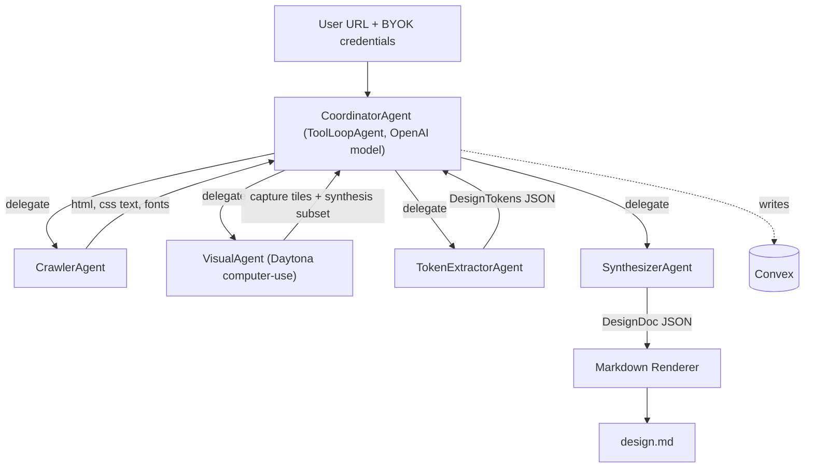
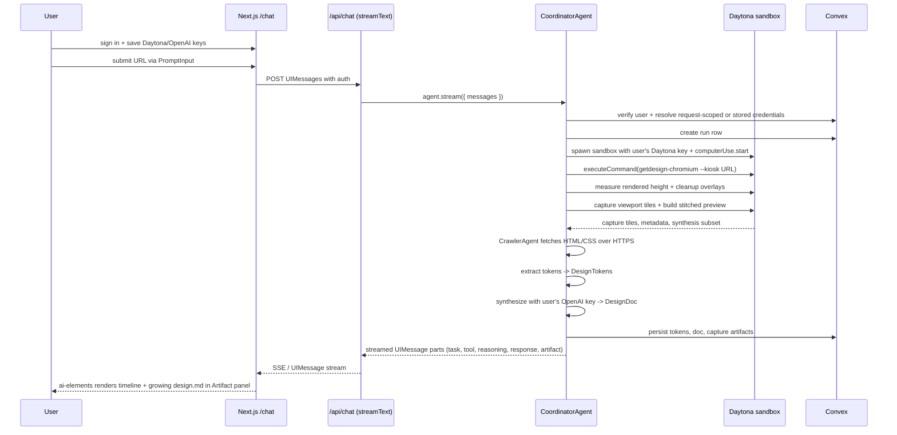

# getdesign — Architecture

On-demand design systems from any URL. An authenticated user provides their own Daytona and OpenAI credentials, either stored for web reuse or sent with an API/SDK/CLI request, submits a URL, and an agent explores the live site with a real browser inside a [Daytona](https://www.daytona.io/docs/en/computer-use/) sandbox, extracts tokens and capture artifacts, and returns a `design.md` matching the reference Cursor-style 9-section template.

This document mixes two things on purpose:

- the long-term target architecture for the product
- notes about the current repository state

When the two differ, the code in this repository is the source of truth for what is implemented today.

## 1. Product surface

Current implementation status:

- `apps/web` is implemented as a marketing site plus `/design` showcase.
- `apps/web/app/api/waitlist/route.ts` is the only shipped API route in this repo today.
- `apps/studio` is a separate Electron desktop Studio project, not one of the hosted getdesign URL-to-`design.md` surfaces.
- `apps/studio-site` is a separate Studio marketing/web project, not the main `getdesign.app` product surface.
- `packages/cli` and `packages/sdk` are placeholder packages, not full end-user surfaces yet.
- `skills/getdesign` is the implemented portable skill surface.

Four consumer surfaces, one agent core.

- **Landing + chat UI** — [apps/web](apps/web) (Next.js 16, App Router, deployed on Vercel). Streaming chat built with [ai-elements](https://www.npmjs.com/package/ai-elements): `Conversation`, `Message`, `PromptInput`, `Task`, `Tool`, `Reasoning`, `Response`, `Sources`, `Image`, and an `Artifact` side panel that renders the growing `design.md`.
- **HTTP API** — [apps/api](apps/api) (Bun + [Hono](https://hono.dev) on Vercel Functions, Node runtime). Single endpoint: authenticated `GET /?url=https://cursor.com` returns `text/markdown; charset=utf-8` (the final `design.md`) when the request provides Daytona and OpenAI credentials or the user has stored credentials.
- **CLI** — [apps/cli](apps/cli) (Bun single-file binary). Two modes: `npx @getdesign/cli <url>` one-shot and `npx @getdesign/cli` interactive REPL ([OpenTUI](https://github.com/openturn/opentui)) that hits the same agent transport.
- **TypeScript SDK** — [packages/sdk](packages/sdk) (`@getdesign/sdk` on npm). A typed client library for Node, Bun, Deno, and edge runtimes. Two entry points: `getDesign(url)` returns a Promise of the final `design.md` + structured `DesignDoc`; `streamDesign(url)` returns an async iterator of progress events for custom UIs. Used by the CLI internally, by AI coding tools programmatically, and by third-party integrations.

All four surfaces call the same agent package; only the transport differs.

Sibling app projects in the monorepo:

- **Studio desktop** — [apps/studio](apps/studio) is the Electron Studio application. It owns local Studio chat state and provider execution concerns, and should be treated as a separate product from the hosted getdesign web/API flow.
- **Studio site** — [apps/studio-site](apps/studio-site) is the Studio marketing/web site. It is separate from [apps/web](apps/web), which is the main getdesign landing/chat product.

## 2. Repository layout (Turborepo, Bun)

Current repository snapshot:

```text
getdesign/
├── apps/
│   ├── api/          Bun + Hono HTTP API
│   ├── deck/         Launch deck slides
│   ├── docs/         Documentation site
│   ├── studio/       Electron Studio desktop app
│   ├── studio-site/  Studio marketing/web site
│   ├── video/        Video app / asset pipeline
│   └── web/          Next.js 16 — main getdesign landing, /design, waitlist route
├── packages/
│   ├── agent/        Coordinator + sub-agents
│   ├── cli/          Placeholder npm CLI package
│   ├── config/       Shared tsconfig package
│   ├── sdk/          Placeholder npm SDK package
│   ├── tools/        Shared crawler / extraction / Daytona tools
│   └── types/        Shared schemas and types
├── convex/           Convex functions (runs, messages, tokens, screenshots, artifacts)
├── skills/           Portable agent skill(s)
├── turbo.json
├── bun.lock
└── package.json      workspaces: apps/*, packages/*
```

Target repository layout (planned, not fully scaffolded yet):

```text
getdesign/
├── apps/
│   ├── web/
│   ├── api/
│   ├── docs/
│   ├── studio/
│   ├── studio-site/
│   ├── deck/
│   └── video/
├── packages/
│   ├── agent/
│   ├── tools/
│   ├── sdk/
│   ├── ui/
│   ├── types/
│   └── config/
├── convex/
├── infra/daytona/
├── turbo.json
├── bun.lock
└── package.json
```

Rationale for the maximal split: the eventual `packages/agent` is reused by web, api, and cli with zero framework coupling; `packages/tools` is what Convex and the AI SDK both call.

## 3. Tech stack and citations

- **Runtime**: [Bun](https://bun.sh) for CLI + API; Node on Vercel Functions for web.
- **Build**: [Turborepo](https://turborepo.com/docs) with remote caching on Vercel.
- **AI SDK**: [`ai` v6](https://ai-sdk.dev) with OpenAI as the v1 synthesis provider. The model provider is resolved from the authenticated user's stored credential so additional LLM providers can be added later without changing the run model.
- **Agents**: `ToolLoopAgent` + `InferAgentUIMessage` per AI SDK v6 docs (`node_modules/ai/docs/` after `bun add ai`).
- **Auth**: Clerk for user identity. Hosted web/API runs require an authenticated user.
- **Chat UI primitives**: [ai-elements](https://ai-sdk.dev/elements) on top of [shadcn/ui](https://ui.shadcn.com).
- **Browser + screenshots**: Chromium launched inside the Daytona Xvfb desktop via `sandbox.process.executeCommand(...)`, captured with Daytona's own [`computerUse.screenshot.takeCompressed()`](https://www.daytona.io/docs/en/computer-use/#take-compressed) / `takeRegion()`. Daytona remains the isolated rendering and screenshot environment; browser-side measurement/control scripts determine actual document height, precise scroll offsets, overlay cleanup, and fixed-element deduplication.
- **Computer-use integration**: [Daytona Computer Use](https://www.daytona.io/docs/en/computer-use/) — `sandbox.computerUse.start()` brings up Xvfb + xfce4 + x11vnc. We use [`screenshot.takeCompressed`](https://www.daytona.io/docs/en/computer-use/#take-compressed) for visible desktop screenshots and keep mouse/keyboard APIs for future interactive states; wheel scrolling is not used as the source of truth for full-page capture because Daytona scroll amounts are wheel ticks, not pixels.
- **Persistence**: [Convex](https://docs.convex.dev) — real-time DB, functions, and file storage for users, encrypted provider credentials, runs, UIMessage history, extracted tokens, capture tiles, stitched previews, and final artifacts.
- **Hosting**: Vercel for web + api (separate Vercel projects); CLI distributed via npm + GitHub releases.

## 4. Agent topology (sub-agents)


```mermaid
flowchart TD
    User["User URL + BYOK credentials"] --> Coordinator["CoordinatorAgent (ToolLoopAgent, OpenAI model)"]
    Coordinator -->|delegate| Crawler["CrawlerAgent"]
    Coordinator -->|delegate| Visual["VisualAgent (Daytona computer-use)"]
    Coordinator -->|delegate| Tokens["TokenExtractorAgent"]
    Coordinator -->|delegate| Synth["SynthesizerAgent"]
    Crawler -->|"html, css text, fonts"| Coordinator
    Visual -->|"capture tiles + synthesis subset"| Coordinator
    Tokens -->|"DesignTokens JSON"| Coordinator
    Synth -->|"DesignDoc JSON"| Renderer["Markdown Renderer"]
    Renderer --> DesignMd["design.md"]
    Coordinator -.writes.-> Convex[("Convex")]
```

Each sub-agent is itself a `ToolLoopAgent` exposed to the coordinator as a single `delegate` tool (per AI SDK v6 sub-agent pattern). Typed end-to-end with `InferAgentUIMessage<typeof coordinator>`.

- **CoordinatorAgent** — plans, calls sub-agents, ensures every run does: (1) crawl, (2) required full landing page capture via VisualAgent, (3) extract tokens, (4) synthesize.
- **CrawlerAgent** — static network tools (no browser needed): `fetchHtml`, `fetchStylesheets`, `resolveFonts`, `parseComputedStylesFromInlined` (resolves `<link rel="stylesheet">`, `@import`, `@font-face`). Runs in Bun on the API server, not in Daytona, to keep sandbox life short.
- **VisualAgent** — tools that wrap the [Daytona TypeScript SDK](https://www.daytona.io/docs/en/computer-use/) directly:
  - `daytonaSpawn` — `daytona.create({ snapshot: 'getdesign-<sha>' })` + `sandbox.computerUse.start()`.
  - `daytonaOpenUrl(url)` — `sandbox.process.executeCommand("DISPLAY=:1 getdesign-chromium --kiosk --no-first-run --hide-crash-restore-bubble --disable-session-crashed-bubble <url>")` and polls until the page is idle.
  - `daytonaMeasureRenderedPage()` — uses a small browser-side script to read viewport size, document height, scroll position, and stability of lazy-loaded content.
  - `daytonaCleanupOverlays()` — dismisses or hides common blockers such as cookie banners, newsletter modals, and chat widgets when possible, recording the action in capture metadata.
  - `daytonaCaptureTiles()` — scrolls to measured pixel offsets, captures viewport-sized tiles with `sandbox.computerUse.screenshot.takeCompressed({ format: 'png', showCursor: false })`, keeps sticky/fixed elements in the first tile, and suppresses repeated fixed elements in later tiles.
  - `daytonaBuildStitchedPreview()` — stitches capture tiles server-side with [`sharp`](https://sharp.pixelplumbing.com) into a derived preview/export image.
  - `daytonaStop` — `sandbox.delete()`.

  Full landing page capture policy: every run must capture the actual rendered landing page from top to document bottom. Capture tiles plus metadata are canonical; the stitched full-page image is derived. The synthesizer receives a curated visual synthesis subset (hero, representative middle tiles, footer/final tile), while the complete capture remains available for preview/export. The capture tool performs three total attempts with fresh Daytona sandboxes before returning final failure to the coordinator.
- **TokenExtractorAgent** — pure deterministic tools (no LLM calls unless ambiguous): `extractColors` (walk computed styles, cluster by frequency/role), `extractTypography`, `extractSpacing`, `extractRadii`, `extractShadows`, `extractBorders`. Emits a `DesignTokens` [Zod v4](https://zod.dev) object.
- **SynthesizerAgent** — takes `DesignTokens` + the visual synthesis subset + crawl notes, returns a `DesignDoc` conforming to a Zod schema with exactly the 9 sections from the reference example. Then a deterministic renderer in [packages/ui/src/renderDesignMd.ts](packages/ui/src/renderDesignMd.ts) converts `DesignDoc` → markdown. This guarantees the exact template ("exact_template" choice).

## 5. 9-section schema (exact template)

Defined in [packages/types/src/design-doc.ts](packages/types/src/design-doc.ts) as a Zod schema. Keys map 1:1 to the sections in the reference example:

1. `visualTheme` — narrative prose + `keyCharacteristics[]`
2. `palette` — `primary`, `accent`, `semantic`, `featureColors`, `surfaceScale`, `borderColors`, `shadows`
3. `typography` — `fontFamily`, `hierarchy[]` (role, font, size, weight, lineHeight, letterSpacing, notes), `principles[]`
4. `components` — `buttons[]`, `cards`, `inputs`, `navigation`, `imageTreatment`, `distinctive[]`
5. `layout` — `spacing`, `grid`, `whitespace`, `radiusScale`
6. `depth` — `levels[]`, `philosophy`
7. `interaction` — `hoverStates`, `focusStates`, `transitions`
8. `responsive` — `breakpoints[]`, `touchTargets`, `collapsingStrategy`, `imageBehavior`
9. `agentPromptGuide` — `quickColorRef`, `examplePrompts[]`, `iterationGuide[]`

The renderer is deterministic; the LLM cannot drift from the template.

## 6. Daytona lifecycle (reuse_snapshot)

Custom snapshot, spawn per request.

- **Build once**: `daytonaio/snapshot:getdesign-<sha>` baked from [infra/daytona/Dockerfile](infra/daytona/Dockerfile) that pre-installs Chromium, `xdotool`, `wmctrl`, `sharp` deps, common web fonts (Inter, Noto Sans / Serif / Color-Emoji, Liberation, DejaVu), and a tuned Xvfb resolution (1440×900×24). Published via `daytona snapshot push`.
- **Per request**: resolve the Daytona credential from request-scoped credentials first, then the authenticated user's encrypted Convex credential → decrypt only for the action invocation when stored → `daytona.create({ snapshot: 'getdesign-<sha>' })` → `sandbox.computerUse.start()` → `daytonaOpenUrl(url)` launches `getdesign-chromium` kiosk on `DISPLAY=:1` → wait for page-ready heuristic → browser-side measurement determines actual rendered height and scroll offsets → overlay cleanup → tile capture via `sandbox.computerUse.screenshot.takeCompressed({ format: 'png' })` → fixed-element deduplication on later tiles → derived stitched preview → upload tiles, metadata, and preview to Convex → `sandbox.delete()`. Target cold-start: under 5 s because the snapshot is pre-baked.
- **Retry contract**: transient Daytona or browser failures are retried inside the capture tool, with three total attempts and a fresh sandbox for each attempt. The coordinator receives either a completed capture or a final failure; it does not silently degrade to text-only output while retry budget remains.
- **Interactive escape hatch** (wired, off by default): if the synthesizer needs a hover/click state, VisualAgent uses [`sandbox.computerUse.mouse.move/click`](https://www.daytona.io/docs/en/computer-use/#click) + another `takeCompressed()`. This is the same API path as the hero capture, so there is no second rendering system.

## 6a. Pricing and credentials

V1 is BYOK-only. getdesign does not bill users and does not subsidize Daytona or LLM usage.

- Hosted runs require Clerk authentication.
- Each user has one active Daytona credential and one active OpenAI credential.
- Web runs use Convex-stored credentials by default after setup.
- API, SDK, and CLI runs may send request-scoped Daytona and OpenAI credentials with the run request. Request-scoped credentials are used for that run only and are not persisted unless explicitly saved.
- Convex stores credential metadata plus encrypted credential payloads. Raw stored credentials are never returned to the client after save.
- Daytona and OpenAI calls use the authenticated user's stored or request-scoped credentials, so users pay those providers directly.
- The LLM credential record includes a provider field. V1 supports OpenAI only; later providers can reuse the same credential and model-resolution boundary.
- CLI direct mode can bypass hosted auth by using local `DAYTONA_API_KEY` and `OPENAI_API_KEY` environment variables. Hosted CLI mode forwards those env vars as request-scoped credentials or falls back to stored account credentials.

## 7. Request flows

### Chat flow

[apps/web/app/api/chat/route.ts](apps/web/app/api/chat/route.ts):


```mermaid
sequenceDiagram
    participant U as User
    participant W as Next.js /chat
    participant R as /api/chat (streamText)
    participant C as CoordinatorAgent
    participant D as Daytona sandbox
    participant CV as Convex
    U->>W: sign in + save Daytona/OpenAI keys
    U->>W: submit URL via PromptInput
    W->>R: POST UIMessages with auth
    R->>C: agent.stream({ messages })
    C->>CV: verify user + resolve request-scoped or stored credentials
    C->>CV: create run row
    C->>D: spawn sandbox with user's Daytona key + computerUse.start
    C->>D: executeCommand(getdesign-chromium --kiosk URL)
    C->>D: measure rendered height + cleanup overlays
    C->>D: capture viewport tiles + build stitched preview
    D-->>C: capture tiles, metadata, synthesis subset
    C->>C: CrawlerAgent fetches HTML/CSS over HTTPS
    C->>C: extract tokens -> DesignTokens
    C->>C: synthesize with user's OpenAI key -> DesignDoc
    C->>CV: persist tokens, doc, capture artifacts
    C-->>R: streamed UIMessage parts (task, tool, reasoning, response, artifact)
    R-->>W: SSE / UIMessage stream
    W-->>U: ai-elements renders timeline + growing design.md in Artifact panel
```

### API flow

[apps/api/src/index.ts](apps/api/src/index.ts): same coordinator, requires auth plus either request-scoped or stored BYOK credentials, awaits full result, and returns `renderDesignMd(doc)` as `text/markdown`. No streaming, no UIMessage parts. Request-scoped credentials must be sent in authenticated HTTPS headers or body fields, not query parameters, and must not be logged.

### CLI flow

[apps/cli/src/index.ts](apps/cli/src/index.ts): one-shot imports [packages/agent](packages/agent) directly (no network hop) when `DAYTONA_API_KEY` + `OPENAI_API_KEY` are set locally, or forwards those env vars as request-scoped credentials to the hosted API. Without local keys, it falls back to hosted API calls using stored account credentials. `npx @getdesign/cli` (no URL) opens an OpenTUI REPL that renders the same UIMessage stream.

## 8. Convex schema (key tables)

Defined in [convex/schema.ts](convex/schema.ts):

- `users` — Clerk-linked user records
- `providerCredentials` — one active Daytona credential and one active OpenAI credential per user; stores provider, masked suffix, status, timestamps, and encrypted secret payload
- `runs` — `{ userId, url, status, startedAt, finishedAt, model, modelProvider, sandboxId, captureId, docStorageId }`
- `messages` — UIMessage parts indexed by `runId` (for chat replay)
- `tokens` — `DesignTokens` JSON per run
- `artifacts` — rendered markdown per run, plus any intermediate partials
- `captures` — canonical full landing page capture record, including rendered height, viewport, overlay cleanup notes, fixed-element dedupe notes, retry count, and links to tile file ids
- `captureTiles` — file storage ids + metadata per tile (width, height, offsetY, sequence, role)
- `stitchedPreviews` — derived full-page preview/export image file ids + metadata

Convex `action` functions wrap the agent so long-running runs survive browser reload; the web client subscribes via `useQuery`.

## 9. Streaming contract (AI SDK v6)

- **Server**: `streamText({ model: openai(selectedModel, { apiKey: userOpenAIKey }), messages, tools, experimental_telemetry })` returned via `toUIMessageStreamResponse()`.
- **UIMessage parts** surfaced to the client, each mapped to an ai-elements component:
  - `tool-crawl.*` → `Task` + `Tool`
  - `tool-screenshot.*` → `Tool` + `Image` (shows capture progress and the stitched preview when ready)
  - `tool-extractTokens.*` → `Task`
  - `reasoning` → `Reasoning`
  - `text` → `Response` streamed into `Artifact` panel as markdown
  - `source-url` (from crawl) → `Sources`
- **Types** shared via `export type GetDesignUIMessage = InferAgentUIMessage<typeof coordinator>` in [packages/agent/src/types.ts](packages/agent/src/types.ts), consumed by `useChat<GetDesignUIMessage>()` in the web app.

## 9a. TypeScript SDK

Published as [`@getdesign/sdk`](https://www.npmjs.com/package/@getdesign/sdk) on npm. Implemented in [packages/sdk](packages/sdk) as a thin client over the HTTP API (so it works in every JS runtime without dragging Daytona / OpenAI deps into the caller's bundle). Also re-exports the `DesignDoc` and `DesignTokens` Zod types from [@getdesign/types](packages/types).

```ts
import { getDesign, streamDesign } from "@getdesign/sdk";
import type { DesignDoc } from "@getdesign/sdk";

// One-shot
const { markdown, doc } = await getDesign("https://cursor.com");
// markdown: string   -> final design.md
// doc:      DesignDoc -> structured 9-section object (Zod-validated)

// Streaming
for await (const event of streamDesign("https://cursor.com")) {
  switch (event.type) {
    case "phase":     // "crawl" | "screenshot" | "extract" | "synthesize"
    case "screenshot":// { viewport: "tile" | "stitchedPreview"; imageUrl }
    case "tokens":    // DesignTokens
    case "delta":     // partial markdown chunk
    case "done":      // { markdown, doc }
    case "error":
  }
}
```

- **Runtime targets**: Node ≥ 20, Bun ≥ 1.2, Deno, Cloudflare Workers, Vercel Edge. Pure Web Fetch + Web Streams under the hood.
- **Transport**: `getDesign` calls authenticated `GET api.getdesign.app/?url=...` (§9, API flow). `streamDesign` calls a second authenticated SSE endpoint `GET api.getdesign.app/stream?url=...` that re-emits the server's UIMessage stream as typed events. Both endpoints are dogfooded by the CLI and may carry request-scoped credentials.
- **Config**: `getDesign(url, { baseUrl?, fetch?, signal?, accessToken?, credentials? })`. `accessToken` authenticates hosted API calls. `credentials` sends request-scoped `{ daytonaApiKey, openaiApiKey }` for the run.
- **Bundle**: ESM-only, zero runtime deps beyond `zod` (peer: `zod@^4`). Tree-shakeable; `streamDesign` imports split from `getDesign`.
- **Types**: full `DesignDoc`, `DesignTokens`, and every event shape are exported from the package root.

## 10. Non-goals for v1

- No follow-up chat (read-only generation).
- No getdesign billing, subscriptions, shared credits, or platform-funded Daytona/OpenAI usage.
- No compare-brands / diff mode.
- No multiple stored credentials per user; v1 allows one active stored Daytona credential and one active stored OpenAI credential.
- No interactive computer-use states (hover, open menu); full landing page capture is required.

## 11. Open risks / verifications before implementation

- Confirm default OpenAI model id and AI SDK provider wiring for user-supplied OpenAI keys.
- Confirm Clerk + Convex auth integration and encrypted credential storage strategy.
- Confirm Chromium kiosk launches cleanly through `/usr/local/bin/getdesign-chromium` on the Daytona Xvfb display without first-run prompts and that `--no-sandbox` is acceptable inside the sandbox. Validate browser-side measurement, stable rendered height detection, overlay cleanup, fixed-element deduplication, tile stitching, and three-attempt retry behavior against 20 real landing pages. Keep `chromium --headless=new --screenshot` as a fallback only, not the primary capture path.
- Confirm AI SDK v6 `ToolLoopAgent` + `InferAgentUIMessage` API shapes against `node_modules/ai/docs/` after `bun add ai` (per ai-sdk skill: do not trust memory).
- Confirm Next.js 16 + ai-elements + [Convex](https://docs.convex.dev) coexist without React version mismatch (ai-elements requires shadcn/ui set up first).

## 12. Delivery order

1. Scaffold Turborepo with Bun workspaces (done).
2. Define Zod schemas in `@getdesign/types` (`DesignTokens`, `DesignDoc`).
3. Implement `@getdesign/tools`: `crawler`, `extractors`, `daytona`, `render`.
4. Author `infra/daytona/Dockerfile` and publish the custom snapshot.
5. Build `@getdesign/agent`: Crawler / Visual / TokenExtractor / Synthesizer / Coordinator.
6. Wire Convex (schema + actions + file storage).
7. Build `apps/web` (Next.js 16 + ai-elements + Artifact panel).
8. Build `apps/api` (Bun + Hono).
9. Build `packages/sdk` (`@getdesign/sdk` on npm) — thin HTTP client with typed events.
10. Build `apps/cli` (Bun + OpenTUI) on top of the SDK.
11. E2E smoke test against `cursor.com`, `vercel.com`, `linear.app`; iterate the synthesizer prompt until output matches the reference template.
12. Deploy web + api to Vercel, publish SDK + CLI to npm.

## References

- Daytona Computer Use: <https://www.daytona.io/docs/en/computer-use/>
- Daytona TypeScript SDK: <https://www.daytona.io/docs/en/typescript-sdk/>
- AI SDK v6: <https://ai-sdk.dev>
- OpenAI: <https://platform.openai.com/docs>
- Clerk: <https://clerk.com/docs>
- ai-elements: <https://ai-sdk.dev/elements> / <https://www.npmjs.com/package/ai-elements>
- shadcn/ui: <https://ui.shadcn.com>
- Next.js 16: <https://nextjs.org/docs>
- Turborepo: <https://turborepo.com/docs>
- Bun: <https://bun.sh/docs>
- Convex: <https://docs.convex.dev>
- Hono: <https://hono.dev>
- Zod v4: <https://zod.dev>
- OpenTUI: <https://github.com/openturn/opentui>
- Reference design-system output format: see `examples/design.md` (derived from the Cursor-inspired sample).
